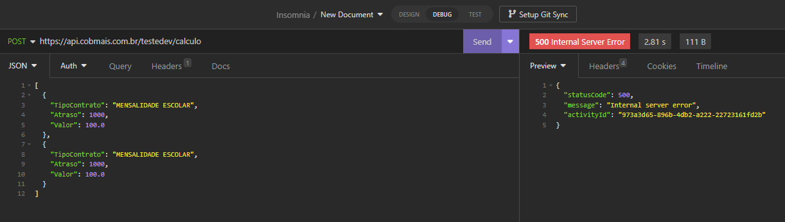

## Ideias para melhorias
- Possibilitar o envio de vários objetos dentro do JSON para otimizar a utilização de recursos da API

## Notas sobre o desenvolvimento
- Inicialmente eu coloquei uma chave primária genérica (Id) em cada tabela. Esse fluxo
é válido, porém eu optei por usar os campos do documento que eu interpretei como únicos pois
usá-los como chave primária facilita o relacionamento entre as tabelas, por permitir o
trabalho com informações que já existem explicitamente, assim otimizando as queries e os algoritmos
