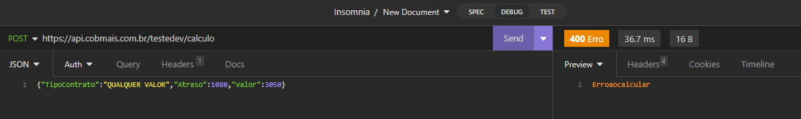
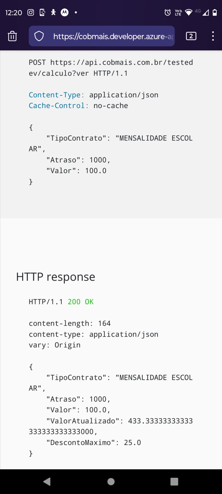
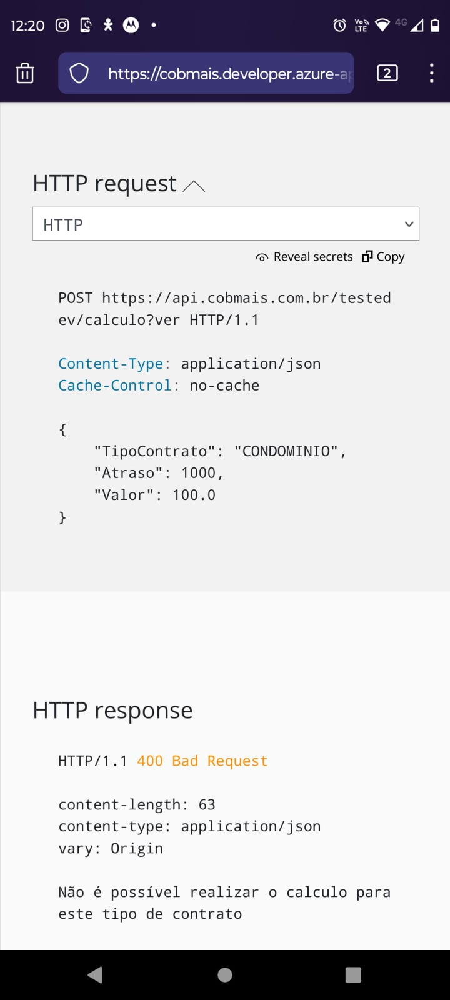

## Ideias para melhorias
- Possibilitar o envio de vários objetos dentro do JSON para otimizar a utilização de recursos da API

- Documentar sobre o caso onde se coloca um tipo de contrato desconhecido

## Bugs no processo de desenvolvimento (e como eu circumví-los)
- Por algum motivo a chamada retorna um erro quando o tipo de contrato é "CONDOMINIO". Esse erro é diferente
do erro que eu mencionei acima nas ideias para melhorias, que ocorre quando se usa qualquer valor; esse erro
é aplicado apenas para o caso do CONDOMINIO. Para usar um ambiente de teste livre dos vieses do meu próprio, 
fui na função de cliente HTTP da própria documentação para provar.

Eu interpretei que a melhor abordagem seria ignorar os registros de condomínio até que eu pudesse
falar com alguem da equipe da Cobmais sobre.

## Notas sobre o desenvolvimento
- A estrutura de tabelas foi definida em 3 tabelas: Clientes, Contratos e LogContratos. Isso se deu pois
eu considerei esta uma forma mais sã, concisa e atômica de separar os dados em seus diferentes domínios,
evitando assim a duplicidade de informações em cada tabela.
- **Sobre Performance**: O processamento foi feito da forma mais direta possível, considerando algumas 
otimizações algorítmicas (como indexar alguns valores que não estão disponíveis em 2 tabelas diferentes utlizando
valores que sim são acessiveis em ambas), mas apenas levando em conta o escopo limitado de 18 contratos
que o arquivo CSV oferece. Para casos de escopos maiores, onde o processamento é intenso e o volume de
dados é grande, existem maneiras de otimizar ainda mais o procedimento. Os exemplos mais óbvios que eu posso 
citar são:

	1. Dividir o arquivo em buffers de tamanhos iguais, onde cada um recebe um número igual de linhas para
processar. O processamento ocorreria de forma paralela através de threads, assim diminuindo o tempo de resposta
da aplicação.
	2. Implementar a melhoria sugerida na API na qual seria permitido enviar, no lugar de um objeto JSON por vez, um array
com vários contratos de uma vez, tal como retornado vários valores atualizados de uma vez. Neste caso, a performance
melhoraria pois fazer chamadas HTTP possui um overhead inerente devido aos dados serem passados por rede.
Portanto, fazer 1 chamada com vários dados é invariavalmente mais rápido que fazer várias chamadas com 1 objeto só.
	3. Manipular a memória diretamente através da feature `unsafe` do C#; porém, isso sacrificaria 
parte da segurança e legibilidade do código.
